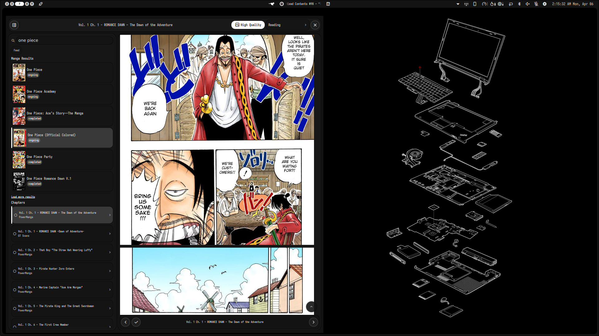

# MangaDex Reader (Noctalia Plugin)

Search, browse, and read manga from MangaDex in a side panel.

## Authentication

1. Enable the plugin in Noctalia settings.
2. Add the bar widget to your bar section.
3. Open plugin settings and enter MangaDex personal client credentials:
   - Client ID (`personal-client-...`)
   - Client Secret
   - MangaDex username or email
4. Authenticate using either:
   - `Login Now` in settings (one-time password), or
   - `Login` in the panel header
5. Session is saved for subsequent launches (password is never stored).

## Known Issues

- Toggling plugin on/off may prevent images from loading. Try force fetch or wait a moment and retry.
- If stuck on "Loading image...", try switching image quality.
- If chapters don't load, click the manga again.

## TODO / Roadmap

- Fix above issues
- Add "My List" tab (default view on startup)
- Feature to add manga to selected list

## Contributing

PRs with bug fixes or features are welcome!